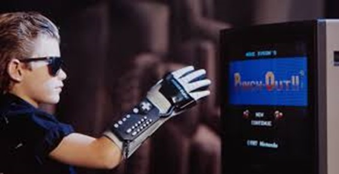

 
### Group 8: Ali Humza, Collins Jonny, Hamilton Shanahan Lukas, Bober Maks

History of VR controllers

**The Sensorama**

The Sensorama was developed in 1962 by Morton Heilig was one of the first example of a virtual reality experiences. Unlike the compact virtual reality headsets of today The Sensorama lacked any controllers.

{alt="sensorama"}

source: <https://www.researchgate.net/figure/Horton-Heiligs-concept-The-Sensorama-Sensorama-simulator-1962_fig9_333855439>

During the early period of virtual reality there was no standardised control input as virtual reality was not available to the general public most virtual reality research during this time was done by NASA and the U.S military.

**Sayre Glove (1977)**

This was one of the earliest implementations of glove-based input for VR. It used flexible tubes filled with light to detect the user’s fingers bending. This glove based input was extremely important as it set the precedent for the main virtual reality control input for the following years to come.

{alt="sayre"}

**The Power Glove (1989)**

The power glove was one of the first commercial virtual reality control inputs; despite being officially licensed by Nintendo for the Nintendo Entertainment System (NES), Nintendo was not involved in the design or release of the accessory. Rather, it was designed by Samuel Cooper Davis for Abrams/Gentile Entertainment (AGE)

Source: <https://en.wikipedia.org/wiki/Power_Glove#:~:text=The%20Power%20Glove%20was%20originally,States%20and%20PAX%20in%20Japan>.

The Power Glove took a lot of inspiration from previous glove-based designs notably the VPL Research Dataglove and built upon them. Though rudimentary, it introduced gesture-based input and gained a cult following.

{alt="DataGlove"}

The VPL Research Dataglove.

Source: <https://www.google.com/url?sa=i&url=https%3A%2F%2Fencyclo-technes.org%2Fen%2Fbase%2F60195x%2F4998&psig=AOvVaw0YcUVlRZBcqqz2xyEA1yv-&ust=1732141180114000&source=images&cd=vfe&opi=89978449&ved=0CBcQjhxqFwoTCLCJ2O-26YkDFQAAAAAdAAAAABAQ>

{alt="PowerGlove"}

The Power Glove

Originally released for $75 ($184 in 2023)

**Sony EyeToy (2003)**

Though not a traditional controller the EyeToy was a camera for the PlayStation 2 that allowed for gesture-based interactions by tacking body movements.

{alt=EyeToy"}

**Nintendo Wii Controller (2006)**

The Wii remote popularized motion-controlled gaming with its gyroscopic sensors and accelerometers. While the Wii remote was designed for traditional console gaming the Wii remote demonstrated how motion tracking enhance immersion and laid the groundwork for similar concepts in VR.

Additionally, the Wii resulted in its competitors; PlayStation and Xbox releasing their own virtual reality controllers to compete with the Wii. Gaming technologies such as that of the Nintendo Wii are considered as non-immersive VR applications.

{alt="WiiRemote"}

**The Playstation Move (2010)**

This was Sony’s answer to the Wii remote, originally for the PlayStation 3, these controllers introduced motion tracking with a glowing orb for spatial positioning. This controller functioned very similarly to the Wii remote. Later during its lifecycle the PS move was the controller used for the PSVR Sony’s own virtual reality headset.

{alt="PSMove"}

**Microsoft Xbox Kinect (2010)**

The Kinect used an RGB camera, an infrared (IR) depth sensor, and a multi-array microphone to track a user’s body in 3D space. It was very different when compared to its competition. Users interacted without holding any physical controller, relying solely on gestures and voice commands. Integrated voice recognition allowed users to control games and apps through spoken commands, an innovation later adopted by VR systems like Meta Quest.

Kinect laid the groundwork for later hand-tracking systems, proving that controller-free input was feasible for interacting with digital environments.

{alt="Kinect"}

**Modern VR controllers**

**Oculus Rift DK1/DK2 (2012-2014)**

These were the first headsets made by the virtual reality titan that is Oculus who were later acquired by Meta. The first oculus headsets were ‘PC powered’ and used standard game controllers and keyboard/mouse dedicated VR controllers weren’t yet a standard.
{alt="Oculus"}
{alt="Oculus"}
**HTC Vive (2016)**

Introduced wand-like controllers with precise motion tracking and buttons for interactions. This was the first commercial headset with sensor-based tracking which allowed the users to move freely in space.

{alt="vive"}

Source: <https://virtualspeech.com/blog/history-of-vr>

**Oculus Touch controllers (2016)**

The oculus touch was a controller released in December 6th 2016 for the Oculus Rift CV1 as a standalone accessory these ergonomically designed controllers that included thumb sticks, buttons, and capacitive touch for more intuitive interactions. Both the oculus touch controllers and HTC Vive controllers set the precedent of the main VR controller design.

**Knuckles (Valve Index) 2019**

These knuckles for the valve index feature advanced tracking and can detect individual fingers currently touching the controller this allowed gripping objects to simulated in VR. Users could also release the controller completely while gripping virtual objects to simulate throwing.

{alt="Valve"}

**Meta (Oculus) Quest Controllers**

Quest series controllers refined tracking and comfort.

Quest 2 (2020) also introduced hand tracking without controllers.

{alt="Quest2"}

**PSVR2 Controllers (2023)**

{alt="PSVR"}

Unlike its predecessor that used the PlayStation move controllers the PlayStation VR2 Sense controllers (2023) incorporated adaptive triggers and haptic feedback for enhanced immersion. They also used the ring design used in modern day VR controllers that contain IR emitting LEDs to track the position of the controller using the cameras in the headset. This also means unlike the original PSVR a separate camera isn’t required to accurately track the controller.

What are the typical parameters of VR controllers?

Parameters in VR controllers define their functionality, tracking accuracy, and responsiveness. These settings ensure that the controllers work effectively for interacting with objects and provide a smooth user experience. Below are some typical parameters and their significance:

**Positional and Rotational Tracking**

- These parameters track the controller's position (X, Y, Z) and orientation (pitch, yaw, roll) in 3D space.
- Ensures that the user's physical movements are mirrored accurately in VR.

**Dead Zones**

- Specifies areas on the joystick or trigger where minor movements are ignored.
- Prevents accidental or unintended input, particularly with worn-out joysticks or sensitive triggers.
- **Example:** Ignoring small unintended thumb-stick movements to avoid character drift.

**Tracking Frequency and Latency**

- Adjusts the frequency of position updates and the response time between the controller and the VR system.
- Ensures real-time, smooth interaction without noticeable delays.
- **Example:** High-frequency tracking for fast-paced games or low latency for precise object manipulation.

**Haptic Feedback Intensity**

- Controls the strength and pattern of vibrations generated by the controller.
- Provides tactile sensations to simulate interactions, enhancing immersion.
- **Example:** A short, sharp vibration when firing a gun versus a continuous rumble when holding an engine.

Controller parameters, such as sensitivity, dead zones, and haptic feedback, aren't just about technical specifications; they shape how users interact with virtual worlds. For example, adjusting the sensitivity of a VR controller can simulate different levels of physical effort, making experiences more immersive. Or how different vibrations can simulate different interactions. These parameters aren't just functional, they help bridge the gap between the digital and physical worlds, enhancing realism and user engagement.

**Object manipulation**

**1\. What is VR Object Manipulation**

Interaction with and modification of virtual objects in 3D environments using hands, controllers, or other interfaces.  
 **• Why it Matters**:  
 • Fundamental for immersive VR experiences, enabling users to perform tasks like grabbing, moving, rotating, and more.  
 **2\. Key Techniques for Object Manipulation**  
 **A. Direct Manipulation**:  
 • Users interact with objects as if they were real using virtual hands or controllers (e.g., grabbing, moving, rotating).  
 • Example: Picking up tools in a VR workshop.  
 **B. Indirect Manipulation**:  
 • Interaction with objects using aids like menus or tools.  
 • Example: Scaling an object or snapping it to a grid for precise placement.  
 **C. Distance Interaction**:  
 **• Raycasting**: Point-and-click with a virtual laser pointer for distant objects, not within immediate reach  
 **• Virtual Magnetism**: Pulling distant objects closer for manipulation.  
 **D. Physics-Based Interaction**:  
 • Mimics real-world physics, such as gravity, collision response or fluid dynamics  
 • Example: Dropping an object to see how it bounces or breaks.  
 **E. Hybrid Interactions**:  
 • Combines techniques like gesture recognition, raycasting, and haptic feedback for a versatile experience.  
   **3\. Challenges in VR Object Manipulation**  
 **• Realism**: Ensuring movements feel natural and accurate.  
 **• Feedback**: Lack of real-world touch and resistance, tackled through e.g. appropriate changes to haptics such as pressure feedback  
 **• Latency**: Delays in system responses can break immersion and even cause motion sickness for the user  
 **• Ergonomics**: Designing controls that don’t fatigue users over time, taking into account different physical abilities  
 **4\. Future Trends and Innovations**  
 **• AI-Powered Gesture Recognition**:  
 • Recognizing more complex hand and body movements without controllers.  
 • Example: Sculpting virtual clay with hands.  
 **• Advanced Haptics**:  
 • Simulating textures, resistance, and vibrations for realistic feedback, this could even include heat  
 **• Collaborative Manipulation**:  
 • Multiple users manipulating the same object in shared virtual spaces, which can be used to simplify complex tasks  
 **5\. Conclusion**  
 • Object manipulation in VR is critical for creating lifelike, engaging virtual experiences.  
 • It combines intuitive interaction methods with advanced technologies like physics engines and AI.  
 • Continuous innovation will make VR object manipulation even more realistic and accessible.  
 • The future of VR lies in enhancing object manipulation to make virtual worlds indistinguishable from reality.

**Sample code**

Due to OpenXR’s integration into unity, creating manipulation of objects in VR can be made very easy. Most simple interactions can be achieved using OpenXR presets. For example teleportation anchors can be created using the TeleportationAnchor component.

{alt="TeleportationAnchor"}

There is also the XRGrabInteractable component. This can be used to configure objects that can be picked up and put down using the controllers. Both of these components lend themselves to customization very well. For example the programmer can invoke public events in scripts from any GameObjects on any interaction event.

{alt="ExampleScript"}

{alt="Calling The Script"}

This allows for quick prototyping and allows for simple projects to be created quickly. While also allowing more complex solutions to be developed.
