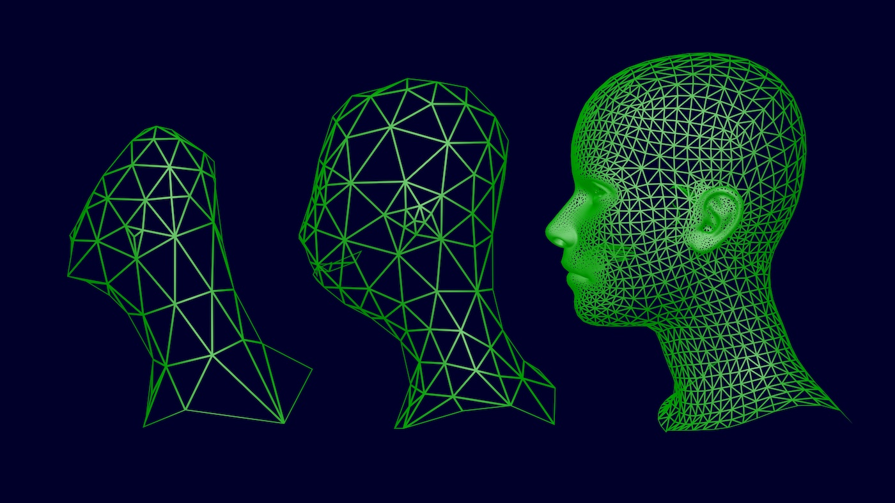

## Types of multi-dimensional media 

We refer to this media as **multi-dimensional**. 
This is because data experts structure information
according to the **dimensions** used to store the data
in the computer system. 

For example, the **name** of one of your friends can
be stored in a data type with **1-dimension**:

```
John Smith
```

Meanwhile, a table which stores the name of all your friends
and their addresses will use a data type similar to 
a spreadsheet table. 

```
| Name            | Address         |
|-----------------|-----------------|
| John Smith      | 34 Street Rd    |
| Marion Lopes    | 105 Babel St    |

```

The latter uses **2-dimensions**
as both rows and columns are used to organised
the data. 

## Digital Images
Data in digital images is organised similar to tables, 
as *pixels*
or *picture element*, which are the smallest element 
of an image, are organised across **2-dimensions**.
We usually refer to these dimensions as the *x*,*y* axis.

{alt="pixels"}

The **image resolution** usually refers to how many 
*pixels* an image has, either as a total or its width. 
This is why *resolution* is usually given
in *2-dimensions*, for example an image with a resolution of
*800 × 600 pixels* will have *800 pixels* across the x-axis
(its width),
and *600 pixels* across the y-axis (its height). The image will contain  
*480,000 pixels* in total.

{alt="3 pictures of a car, from a high resolution (to the left) to a low resolution (to the right)"}

Meanwhile, the **PPI** or **DPI** (**Pixels per Inch** or **Dots Per Inch**) 
attributes of images refers
to their pixel density. That is how many pixels there are in 
1 inch (2.54 cm) in the display in which the image
is *rendered* or in the printed image. 

{alt="DPI example"}

Example of digital images include digital photographs generated
by a camera sensor (e.g. on a smart phone), or synthetic
images created on directly on the computer (e.g. painting tools or generated
by Artificial Intelligence software).

{alt="photographs"}
{alt="generated"}

Given the wide-availability of camera sensors, including
on smart phones and digital cameras,
digital images are the widest available multi-dimensional media.

Collections of images are found across many website, and popular search engines
now support image-based search which allows to search digital-images
across websites given an input image. See examples:

- [Pixabay](https://pixabay.com/)
- [Wikimedia Commons](https://commons.wikimedia.org/wiki/Category:Images)
- [Adobe Stock](https://stock.adobe.com/)
- [Shutterstock](https://www.shutterstock.com/)
- [Flickr](https://www.flickr.com/)

::::::::::::::::::::::::::::::::::::: challenge 

## Challenge 1: Search for images

Save the image below and navigate in your browser to [https://www.google.com/](https://www.google.com/).
Using the camera image on the search bar, search for the image.

{alt="Peter Rabit magazine"}

::::::::::::::::::::::::::::::::::::::::::::::::

Finally, images are commonly stored using formats such such as:
- *JPEG*, short for Joint Photographic Experts Group, and *PNG*
*Portable Network Graphics* formats compress
pixel information making the files size smaller.
- *TIFF*, short for Tag Image File Format, 
stores non-compressed information, making the file sizes larger.

Digital photography will make use
of other formats, such as *DNG* or *RAW* to store raw image information. 
Other software store image projects in proprietary formats, meaning files
can only be open by these.


## Digital Video

Digital video could be considered a **2-dimensional** or, even a **3-dimensional**,
type of media.

This is because a video contains many images or **frames**, which are stored
in **2-dimensions** as described above, and rendered sequentially.

{alt="frames in video"}
{alt="frames in video frog"}


Video also have a **Resolution** which is related to the images.
Resolution will be the same for all the frames in a video file.
For instance 4K video is usually made of frames which are
X x Y in resolution.

The rate at which frames are displayed is usually referred
to as **Frames Per Second** or **FPS**. For reference,
TV and movies are usually displayed at 24 FPS.

Video is also a popular type of content, as there are many platforms
on the web which allow
users to easily share their media. See examples:

- [YouTube](https://www.youtube.com)
- [Vimeo](https://vimeo.com/)
- [Wikimedia](https://commons.wikimedia.org/wiki/Category:Videos)


Note that while images can be downloaded by web browsers, 
it is not always possible to download video 
from these websites. Many times, video is only made available
through a media player.

There are many formats to store video and audio, including
those supported by webpages:

- MP4 (MPEG-4) is a common *container format* which can play
in almost all devices and over the web.
- WebM and OGG are open video formats.

There are many others [formats](https://en.wikipedia.org/wiki/Video_file_format).
Note that videos with higher resolution and FPS will 
be larger and hence, challenging 
to send via email or download over the web. 

## 3D Images or Models
Before exploring what 3D images or 3D models are, 
there are some relevant concepts to cover.

:::::::::::::::::::::::::::::::::::::::::::::::::::::::::::::::::::: instructor

This exercise requires having access to blank paper and a square-grid paper.

::::::::::::::::::::::::::::::::::::::::::::::::::::::::::::::::::::::::::::::::

::::::::::::::::::::::::::::::::::::: challenge 

## Challenge 1: Drawing a 3D-cube

In a piece of blank paper, draw a 3-dimensional cube or box of dimensions:

height = 1 

width = 1  

depth = 1

::::::::::::::::::::::::::::::::::::: solution 


:::::::::::::::::::::::::::::::::

## Challenge 2: Draw it again

Now, using a square-grid paper draw again your cube or box using the 
same dimensions. In this exercise you must decide whether to fill or
not the squares of the grid to draw your 3-dimensional box.

:::::::::::::::::::::::: solution 

You have just experienced the concept of **Rasterisation**. 

This challenge illustrates the decision made by the computer
on what information to display on the screen. It must decide
whether a pixel should be drawn or not to represent the 
information of the 3D-cube you drawn.

:::::::::::::::::::::::::::::::::
::::::::::::::::::::::::::::::::::::::::::::::::


**Rasterisation** is the process 
to go from a **vector** graphics description 
into a **raster** image. In this process, we understand:

- The **vector** description allows a user to
draw primitives such
as 2D polygons, line segments and 3D shapes using 
coordinates (e.g. (1,0)) or mathematical functions.

{alt='square vector format'}
In the example above, a user can describe a 
cube using 4 coordinates: (0,0), (1,0), (1,1) and (0,1).

- The **raster image** is the pixel-based representation of the
vector description.

{alt='square raster format' width=70%}


Now that we covered these concepts, we return to the definition of
**3-dimensional** media. A **3-dimensional** image or model
normally refers to a file(s) with vector data which describes 
spatial information.
For example, 

- Points in space acquired by a sensor device such
as a 3D scanner, or 
- An architectural 3D drawing with measurements for walls and other
architectural elements.

```stl
solid cube-ascii
    facet normal  0.000000e+00  0.000000e+00  1.000000e+00
        outer loop
            vertex  0.000000e+00  0.000000e+00  1.000000e+01
            vertex  1.000000e+01  0.000000e+00  1.000000e+01
            vertex  0.000000e+00  1.000000e+01  1.000000e+01
        endloop
    endfacet
    facet normal  0.000000e+00  0.000000e+00  1.000000e+00
        outer loop
            vertex  1.000000e+01  1.000000e+01  1.000000e+01
            vertex  0.000000e+00  1.000000e+01  1.000000e+01
            vertex  1.000000e+01  0.000000e+00  1.000000e+01
        endloop
    endfacet
    facet normal  1.000000e+00  0.000000e+00  0.000000e+00
        outer loop
            vertex  1.000000e+01  0.000000e+00  1.000000e+01
            vertex  1.000000e+01  0.000000e+00  0.000000e+00
            vertex  1.000000e+01  1.000000e+01  1.000000e+01
        endloop
    endfacet
    facet normal  1.000000e+00  0.000000e+00  0.000000e+00
        outer loop
            vertex  1.000000e+01  1.000000e+01  0.000000e+00
            vertex  1.000000e+01  1.000000e+01  1.000000e+01
            vertex  1.000000e+01  0.000000e+00  0.000000e+00
        endloop
    endfacet
    facet normal  0.000000e+00  0.000000e+00 -1.000000e+00
        outer loop
            vertex  1.000000e+01  0.000000e+00  0.000000e+00
            vertex  0.000000e+00  0.000000e+00  0.000000e+00
            vertex  1.000000e+01  1.000000e+01  0.000000e+00
        endloop
    endfacet
    facet normal  0.000000e+00  0.000000e+00 -1.000000e+00
        outer loop
            vertex  0.000000e+00  1.000000e+01  0.000000e+00
            vertex  1.000000e+01  1.000000e+01  0.000000e+00
            vertex  0.000000e+00  0.000000e+00  0.000000e+00
        endloop
    endfacet
    facet normal -1.000000e+00  0.000000e+00  0.000000e+00
        outer loop
            vertex  0.000000e+00  0.000000e+00  0.000000e+00
            vertex  0.000000e+00  0.000000e+00  1.000000e+01
            vertex  0.000000e+00  1.000000e+01  0.000000e+00
        endloop
    endfacet
    facet normal -1.000000e+00  0.000000e+00  0.000000e+00
        outer loop
            vertex  0.000000e+00  1.000000e+01  1.000000e+01
            vertex  0.000000e+00  1.000000e+01  0.000000e+00
            vertex  0.000000e+00  0.000000e+00  1.000000e+01
        endloop
    endfacet
    facet normal  0.000000e+00  1.000000e+00  0.000000e+00
        outer loop
            vertex  0.000000e+00  1.000000e+01  1.000000e+01
            vertex  1.000000e+01  1.000000e+01  1.000000e+01
            vertex  0.000000e+00  1.000000e+01  0.000000e+00
        endloop
    endfacet
    facet normal  0.000000e+00  1.000000e+00  0.000000e+00
        outer loop
            vertex  1.000000e+01  1.000000e+01  0.000000e+00
            vertex  0.000000e+00  1.000000e+01  0.000000e+00
            vertex  1.000000e+01  1.000000e+01  1.000000e+01
        endloop
    endfacet
    facet normal  0.000000e+00 -1.000000e+00  0.000000e+00
        outer loop
            vertex  1.000000e+01  0.000000e+00  1.000000e+01
            vertex  0.000000e+00  0.000000e+00  1.000000e+01
            vertex  1.000000e+01  0.000000e+00  0.000000e+00
        endloop
    endfacet
    facet normal  0.000000e+00 -1.000000e+00  0.000000e+00
        outer loop
            vertex  0.000000e+00  0.000000e+00  0.000000e+00
            vertex  1.000000e+01  0.000000e+00  0.000000e+00
            vertex  0.000000e+00  0.000000e+00  1.000000e+01
        endloop
    endfacet
endsolid
```

This type of dataset can also extend into **4-dimensions** by
also considering time. For instance, data captured
by a motion capture device will produce a vector data which changes
every time the device samples new data. We call this measure
sampling rate per second.

{alt="motion capture"}


The **vector** description allows a user to
draw primitives such
as 2D polygons, line segments and 3D shapes using 
coordinates (e.g. (1,0)) or mathematical functions.


**3D image** or model files contain **vector** information,
including:

- Points or vertices with coordinate information
- Information on how various points are connected to form
shapes such as triangles, which is known as the topology
or connectivity of the 3D model.

{alt="3D vector data"}


The number of points/vertices or triangles will
determine the resolution of the 3D model. 
Look out for this number, the higher the triangles, the 
longer it will take the computer to download/draw this
3D model.
Web platforms examples:

Another important ter is the term *raster*. 


in a dot matrix display device. 


is the smallest addressable element in a , or the smallest addressable element in a dot matrix display device. 


 **dimensional** is used 

The term **mult-dimensional**

Our proposed multidimensional data service specifically addresses the needs of Culture
(e.g. GLAM sector, art history, visual arts) and Creative communities,
focusing on representational and derivative media created through
digitisation processes during research, for instance on cultural
collections and archives within the GLAM sector, including their
interpretation and conservation, as well as other creative research
practices within disciplines such as the visual arts, design, media, and
performance. These works often result in large, multi-part, and
multi-format datasets which describe the creation process, as in the
various steps involved in the digitisation of an artefact into a 3D
model, or the project files for their visualisation in an immersive
environment or a simulation. Thus, we refer to this content as
complex multidimensional data.


## Advice:

- Always look for maximum resolution
- Download content where possible


## Important definitions

- ** Resolution ** 
- ** Rendering ** 
- ** Frame ** 

## Filenames
		Placewherefilewasdownloadedfrom_ID_[high|med|low].[format] 
## Metadata

Dublin-Core


## Making it FAIR

Findability, Accessibility, Interoperability and Reuse of digital assets.


Wilkinson, M., Dumontier, M., Aalbersberg, I. et al.
The FAIR Guiding Principles for scientific data management and stewardship. Sci Data 3, 160018 (2016). https://doi.org/10.1038/sdata.2016.18 


## What are FAIR principles
Findability

“The first step in (re)using data is to find them. Metadata and data should be easy to find for both humans and computers. Machine-readable metadata are essential for automatic discovery of datasets and services…” https://www.go-fair.org/fair-principles/ 

SOLUTION:

Global unique and persistent Identifier for (Meta)data
Rich metadata description
Metadata include identifier of the data
(Meta)data are registered or indexed in a searchable resource

EXAMPLE: A DOI is a digital identifier of an object, any object — physical, digital, or abstract. https://www.doi.org/the-identifier/what-is-a-doi/  


What are FAIR principles
Accessible

The user “need to know how they can be accessed, possibly including authentication and authorisation”.
https://www.go-fair.org/fair-principles

SOLUTION:

Free open and universally accessible communication protocol
Accessibility of metadata when data no longer available

EXAMPLE:
http(s), ftp, SMTP, HMAC etc.. however when data is sensible these protocols may not have enough security that is why it is necessary to include within the metadata the contacts (telephone, email) of the person or entity responsible of the data.


What are FAIR principles
Interoperable

“The data usually need to be integrated with other data. In addition, the data need to interoperate with applications or workflows for analysis, storage, and processing.” https://www.go-fair.org/fair-principles/ 

SOLUTION:

Metadata uses accessible and shared language
Vocabulary that follow FAIR principles
(Meta)data includes  qualified reference to other (meta)data

EXAMPLE:
RDF extensible knowledge representation model
https://www.dublincore.org/schemas/rdfs/


Reusable

“…metadata and data should be well-described so that they can be replicated and/or combined in different settings.”
https://www.go-fair.org/fair-principles 

SOLUTION:

(Meta)data should have:
Rich description with plurality of accurate and relevant attributes
Released with a clear and accessible data usage license
Meet domain-relevant community standards

EXAMPLE:


What are FAIR principles
FAIRification Process

Choosing the right platform to visualize, retrieve and publish multidimensional data on the web (online platforms, self-hosted viewers and frameworks).
There are various platforms to visualize digital asset on the web for cultural heritage, some are more general (they accept different files types and formats) and some are more specifics.

In this instance we are interested at the ones that can read and write 3D data (although some of this platforms and tools can also be implemented for other types of data).

Some of this platforms although are free to use they are proprietary while some other they embrace the concept of Open Data/Open Source. In the tutorial we will focus on the latter. 


Choosing the right platform to visualize, retrieve and publish multidimensional data on the web (online platforms, self-hosted viewers and frameworks).
Online Platforms and Frameworks

Online service that permit to browse, download and upload multidimensional data. These can be free or paid services.

Compacct: https://kompakkt.de
Aton: https://osiris.itabc.cnr.it/aton/ 
Exhibit: https://www.exhibit.so/ 
Arches: https://www.archesproject.org/ 
Open Heritage 3D: https://openheritage3d.org/ 
Visual Media Service: https://visual.ariadne-infrastructure.eu/
Sketchfab:  https://sketchfab.com/ 


Choosing the right platform to visualize, retrieve and publish multidimensional data on the web (online platforms, self-hosted viewers and frameworks).
Self-Hosted Viewers

Proprietary or open source 3D viewers that can be installed on a server or locally

Universal viewer: https://universalviewer.io/ 

3DHOP: https://3dhop.net/

ONLINE 3D VIEWER: https://3dviewer.net/

Voyager Story Standalone: https://3d.si.edu/labs  

And many more….


Choosing the right platform to visualize, retrieve and publish multidimensional data on the web (online platforms, self-hosted viewers and frameworks).
Frameworks

IIIF (International Image Interoperability Framework)
IIIF is a globally-adopted open source standardized model for delivering many types of image-based resources on the web in many different formats so that audiences can interact with them. It provides a lot of benefits to the institutions that use it, and when implemented across many institutions provides additional benefits across institutional boundaries. https://training.iiif.io/annotations/iiif_intro/whatisiiif.html 


Choosing the right platform to visualize, retrieve and publish multidimensional data on the web (online platforms, self-hosted viewers and frameworks).
Frameworks
Aton
A framework based on Node.js and Three.js designed, developed and coordinated by B. Fanini (VHLab, CNR ISPC – ex ITABC) to create Web3D/WebXR apps (presenters, applied games, tools, etc…) interacting with CH objects and 3D scenes on the Web. It adopts a “develop once, deploy everywhere” approach, without requiring any installation for final users, with its front-end automatically adapting to the device (mobile, desktop/kiosk or immersive VR).


Choosing the right platform to visualize, retrieve and publish 3D data in heritage context on the web (online platforms, self hosted viewers and frameworks).
Platform
Arches
Arches is an open-source data management platform that is freely available for organizations worldwide to install, configure, and extend in accordance with their individual needs and without restrictions on its use. Arches was originally developed for the cultural heritage field by the Getty Conservation Institute and World Monuments Fund. Due to the complex and varied nature of cultural heritage data, and to promote interoperability and sustainable data practices, the Arches Platform has been developed as a standards-based, comprehensive and flexible platform that supports a wide array of uses. T


References and links used in the presentation 

FAIR principles: https://www.nature.com/articles/sdata201618 ,  https://www.go-fair.org/fair-principles/ , https://www.datafairport.org/
Identifiers: https://www.doi.org/the-identifier/what-is-a-doi/  
Web repository Article: https://www.sciencedirect.com/science/article/pii/S221205481930058X
WebGL: https://www.khronos.org/webgl/ 


## Introduce D4Science infrastructure (Nicola)

Login

Workspace Environment

Common actions 

Upload

Editing Environment: Introduction to JupyterLab 

Common actions - menu

Edit


## Copyright for publishing

References and links used in the presentation 
British library: https://www.bl.uk/business-and-ip-centre/articles/what-is-copyright
Jisc guides: https://www.jisc.ac.uk/full-guide/copyright-law
Gov.uk: https://www.gov.uk/copyright
Gov.uk - copyright images: https://www.gov.uk/government/publications/copyright-notice-digital-images-photographs-and-the-internet/copyright-notice-digital-images-photographs-and-the-internet
Creative commons licenses: https://creativecommons.org/licenses/
Creative commons license chooser: https://chooser-beta.creativecommons.org/
Business models and inspiration from the creative community on using CC for their work: Creative Commons Corporation (2011), The Power of Open, https://thepowerofopen.org/assets/pdfs/tpoo_eng.pdf
Pila, Justine, Copyright and its Categories of Original Works (July 1, 2008). Oxford Journal of Legal Studies, Vol. 30, No. 2, pp. 229–254, 2010, Oxford Legal Studies Research Paper No. 22/2008, Available at SSRN: https://ssrn.com/abstract=1160176 or http://dx.doi.org/10.2139/ssrn.1160176
Wallace, Andrea. A Culture of Copyright: A scoping study on open access to digital cultural heritage collections in the UK. Research Report. Towards A National Collection, UKRI, (2022), https://openresearch.community/documents/a-culture-of-copyright-a-wallace

What is copyright?
Copyright is a legal right, which protects the copyright owner and/or the creator of a work.
Copyright gives the owner control over their work and how it is used.
Copyright is one of the four areas of intellectual property, with others being patents (how something works), designs (what something looks like), trademarks (what you call it).
Works use the copyright symbol (©), a name and the year of creation.

Who owns the copyright?
There is no system in the UK for registering copyright. 
Authors automatically get copyright protection when the work is created.
Unless the work was created by an employee during their employment, or the copyright is transferred to someone else as part of their agreement. 
What works does copyright protect?
There is no copyright protection for ideas/concepts. Copyright only protects  works when ideas are expressed in a form that can be reproduced or copied:
Original literary, dramatic, musical and artistic work, including illustration and photography
Original non-literary written work, such as software, web content and databases
Sound and music recordings
Film and television recordings
Broadcasts
the layout of published editions of written, dramatic and musical works

Multiple independent copyrights
The copyright in each type of work exists independently, e.g. a song may be covered by copyright:
on the entire CD which contains the song
on the lyrics as a literary work
on the music of the song as its performance.


How copyright protects work
➤ Copyright prevents people from:
copying work
distributing copies of someone’s work, whether free of charge or for sale
renting or lending copies of someone’s work
performing, showing or playing someone’s work in public
making an adaptation of someone’s work
putting someone’s work on the internet.

Copyright duration
Copyright protection starts as soon as a work is created. After copyright expires, the work is in the public domain so anyone can use or copy the works. 
Digital images in copyright law
Digital photos taken on mobile phones and digital cameras.
Images that were first generated on photographic film and any digital images created from them.
Images such as diagrams and illustrations

Using copyrighted work
➤ To use something protected by copyright these are the options that someone has:
Agree a licence with the owner to use it:
find owner
agree a licence agreement (permission about format, extent, purpose and time of use)
respect moral rights (attribution right, right of integrity, right to object to false attribution)
Buy or acquire the copyright
Confirm that your intended use falls within the exceptions to copyright.

Copyright owner, freelance work, commissions
The copyright is an automatic right and does not need to be registered or paid for (by its owner).
The first owner of copyright will normally be the author (who created the work).
There are certain exceptions, especially in the case of photographs, films and recorded sound (e.g. making content accessible for disabled people, text and data mining for research, teaching, fair dealing and more)
An employer is normally the first owner of copyright in work which is made in the course of an author's employment under a contract (this applies to employees, not freelancers).
For commissioned work, the copyright usually lies with person who has been commissioned.
It is important when commissioning work to put an agreement in place first covering the intellectual property.   
Copyright of images in the UK
Photographs, illustrations and other images will generally be protected by copyright as artistic works.
The copyright owner of a photograph is its creator, i.e. the photographer or the organisation/employer with which the photographer has a contractual agreement.
The creator of an image may choose to allow a person or organisation to license the work on their behalf, license the copyright directly themselves, or “assign” (transfer) the copyright to another person.
Copyright in images lasts for the life of the creator plus 70 years from the end of the calendar year of their death although the length of the copyright period will depend on when the image was created. Images less than 70 years old are still in copyright, and older ones may well be, depending on when the creator died.

Digital images in copyright law
Creating a copy of an image won’t result in a new copyright in the new item. 
There is some uncertainty regarding whether copyright can exist in digitised copies of older images for which copyright has expired.
Some argue that a new copyright may arise in such copies if specialist skills have been used to optimise details (i.e. retouching images).
According to established case law, copyright can only subsist in subject matter that is original in the sense that it is the author’s own ‘intellectual creation’.

Some types of licences
➤ Licences are contractual agreements between the copyright owner/s and user/s limiting how the work can be used. Examples of licences are:
Jisc Collections
Blanket licences (by a collecting society, e.g. CLA)
Open educational resources (OERs, e.g. usually Creative Commons)
Creative Commons
Orphan works
More information: https://www.jisc.ac.uk/full-guide/copyright-law


Creative Commons Licenses
CC is a standardized way to grant copyright permissions to creative work by individuals, organisations and institutions.
CC help creators to retain copyright while allowing others to copy, distribute, and make some uses of their work.
CC licenses work around the world and last as long as applicable copyright lasts (because they are built on copyright).
CC common features serve as baseline, on top of which licensors can choose to grant additional permissions.
CC licenses do not affect freedoms that the law grants to users of creative works otherwise protected by copyright, such as exceptions and limitations, such as fair dealing.
CC licenses
CC licenses
Creative Commons licenses by Foter licensed under CC-BY-SA
Database rights
An electronic database may be protected by copyright and database rights.
Database rights will cover a collection of copyrighted works.
Permission must have been obtained from the copyright holders for the use of their work.
Database rights are automatic and have no registration forms or fees and give the owner total control over their work. You can use, sell or lease it to a third party.
Database rights last for 15 years from creation, but if published during this time the term is 15 years from publication.   


## Excercise: Curating a multi-dimensional dataset for storytelling (Nicola)

In teams of 2-3 curate a dataset. Focus on gather content beyond images, look for 
video and 3D

Pay attention of advice for images, videos and 3D models.

Pay attention to filenames.

Check for copyright 


## Storytelling with multi-dimensional data


A variety of storytelling tools:

- Storytelling tools: [TimeMapper from Open Knowledge Foundation Labs]( https://timemapper.okfnlabs.org/)
- [Meet StoryMaps](https://storymaps.com/)

https://mercator.tass.com/mercator-map
This is a lesson created via The Carpentries Workbench. It is written in
[Pandoc-flavored Markdown][pandoc] for static files (with extension `.md`) and
[R Markdown][r-markdown] for dynamic files that can render code into output
(with extension `.Rmd`). Please refer to the [Introduction to The Carpentries
Workbench][carpentries-workbench] for full documentation.


:::::::::::::::::::::::::::::::::::::::::::::::::::::::::::::::::::: instructor

Inline instructor notes can help inform instructors of timing challenges
associated with the lessons. They appear in the "Instructor View"

::::::::::::::::::::::::::::::::::::::::::::::::::::::::::::::::::::::::::::::::

::::::::::::::::::::::::::::::::::::: challenge 

## Challenge 1: Can you do it?

What is the output of this command?

```r
paste("This", "new", "lesson", "looks", "good")
```

:::::::::::::::::::::::: solution 

## Output
 
```output
[1] "This new lesson looks good"
```

:::::::::::::::::::::::::::::::::


## Challenge 2: how do you nest solutions within challenge blocks?

:::::::::::::::::::::::: solution 

You can add a line with at least three colons and a `solution` tag.

:::::::::::::::::::::::::::::::::
::::::::::::::::::::::::::::::::::::::::::::::::

## Figures

You can include figures generated from R Markdown:

```{r pyramid, fig.alt = "pie chart illusion of a pyramid", fig.cap = "Sun arise each and every morning"}
pie(
  c(Sky = 78, "Sunny side of pyramid" = 17, "Shady side of pyramid" = 5), 
  init.angle = 315, 
  col = c("deepskyblue", "yellow", "yellow3"), 
  border = FALSE
)
```
Or you can use pandoc markdown for static figures with the following syntax:

`{alt='alt text for
accessibility purposes'}`

{alt='Blue Carpentries hex person logo with no text.'}

## Math

One of our episodes contains $\LaTeX$ equations when describing how to create
dynamic reports with {knitr}, so we now use mathjax to describe this:

`$\alpha = \dfrac{1}{(1 - \beta)^2}$` becomes: $\alpha = \dfrac{1}{(1 - \beta)^2}$

Cool, right?

::::::::::::::::::::::::::::::::::::: keypoints 

- Use `.md` files for episodes when you want static content
- Use `.Rmd` files for episodes when you need to generate output
- Run `sandpaper::check_lesson()` to identify any issues with your lesson
- Run `sandpaper::build_lesson()` to preview your lesson locally

::::::::::::::::::::::::::::::::::::::::::::::::

