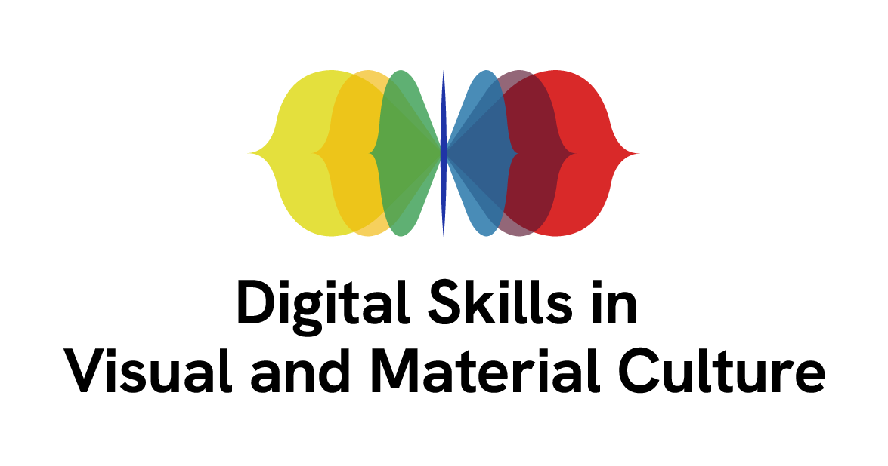

## Data Sets
Data will be produced during the workshop,
so you will mostly need access to a web browswer and some space in your
computer to store the data.
<!--
FIXME: place any data you want learners to use in `episodes/data` and then use
       a relative link ( [data zip file](data/lesson-data.zip) ) to provide a
       link to it, replacing the example.com link.
-->
## Software Setup

::::::::::::::::::::::::::::::::::::::: discussion

### Details

For this lesson, you will need access to some paper and pen. 

Access to the [Culture Digital Skills Virtual Research Environment D4Science](https://services.d4science.org/group/culturedigitalskills) is also 
required.

If you have not registered, it would be useful to do this before
the lesson. For more information, see [instructions](https://universityofbrighton.github.io/2023-fair-multidimensional-media/virtual-research-environment.html#virtual-research-environments-vre)

:::::::::::::::::::::::::::::::::::::::::::::::::::

The tutorial is built with [The Carpentries Workbench](https://carpentries.github.io/sandpaper-docs/), as part of the training activities of the [AHRC-funded network service on Digital Skills in Visual and Material Culture](https://www.culturedigitalskills.org). 

{width=50% alt="logo"}
