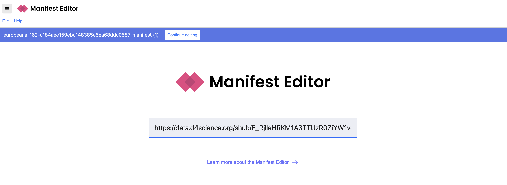

During this exercise you will curate a story bringing together multidimensional 
media using [Exhibit](https://www.exhibit.so/) tool.

The example below shows a story of the Kinora, which was an 
early motion picture device developed by the French inventors Auguste and Louis Lumière 
in 1895. 

The story brings together images, videos and 3D models to illustrate the
history of these artefacts, their context and mechanics. The media 
with which this story as developed is available [here](https://data.d4science.org/workspace-explorer-app?folderId=MUVkZVY5L1hRYnV4ZzJiUVljVlk5U1hmOHZYaDQ1SGVZT0l6aUZGa2lEclVFT0ppWEo4VDRzU2Z0alNiSk5GTg). 

You can also view the story
here: [https://www.exhibit.so/exhibits/zrHKbV2wqdpcRyfVW05M](https://www.exhibit.so/exhibits/zrHKbV2wqdpcRyfVW05M)

<iframe src="https://www.exhibit.so/exhibits/zrHKbV2wqdpcRyfVW05M?embedded=true" width="100%" height="600" allowfullscreen allow="autoplay" frameborder="0"></iframe>

## Developing a story in Exhibit
Using the dataset of multidimensional data
which you previously curated, the task is 
to create a story which brings all of this together.

Use the tutorial Exhibit website: [https://exhibit-culturedigitalskills.vercel.app/](https://exhibit-culturedigitalskills.vercel.app/)

You will need to register to use the tool.

More instructions on creating an Exhibit are here: [https://exhibit-culturedigitalskills.vercel.app/docs](https://exhibit-culturedigitalskills.vercel.app/docs)

## IIIF content
You can upload files for images and 3D models,
or use existing IIIF content with Exhibit.

If you would like to use a IIIF Manifest, you can use a tools such as
[Digirati Manifest Editor](https://manifest-editor.digirati.services/).

Create the JSON file using the editor, and upload it alongside the media content
in D4Science. Then you can provide this JSON url to Exhibit.

To create the JSON, use the following JSON files as examples. 
Pasting the URL links to the in the [Digirati Manifest Editor](https://manifest-editor.digirati.services/) interface:

- Image: [https://data.d4science.org/shub/E_RjlleHRKM1A3TTUzR0ZiYW1vcjFtNWVyY0JPTzU0djdDNzMrV09LMWgzenF4K0lYc0MzNnZud3BNSHZrK3ZWdQ==](https://data.d4science.org/shub/E_RjlleHRKM1A3TTUzR0ZiYW1vcjFtNWVyY0JPTzU0djdDNzMrV09LMWgzenF4K0lYc0MzNnZud3BNSHZrK3ZWdQ==)
- Video: [https://data.d4science.org/shub/E_em1ReGc4cE13N2NPYTJrRXUwS3BEbTJqMU5RSEx5cFZ5aXZTRUJ0MDVDdTNsMk5PaUhGOVRmL0FwSThHdmNHNQ==](https://data.d4science.org/shub/E_em1ReGc4cE13N2NPYTJrRXUwS3BEbTJqMU5RSEx5cFZ5aXZTRUJ0MDVDdTNsMk5PaUhGOVRmL0FwSThHdmNHNQ==)
- 3D model: [https://data.d4science.org/shub/E_djREWnFmY1BMS0FJSDh2cTBPQXUwc090NmpldmR3QkNyRWxmN0RvWFZQWWN2TG5OMFM1cWJocWxXNm85dUdYUA==](https://data.d4science.org/shub/E_djREWnFmY1BMS0FJSDh2cTBPQXUwc090NmpldmR3QkNyRWxmN0RvWFZQWWN2TG5OMFM1cWJocWxXNm85dUdYUA==)

{alt="editor"}

